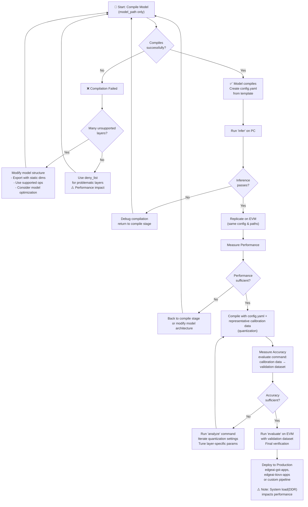

# Frequently Asked Questions

Please find common questions from users. If your question is not covered here, please open an Issue or a ticket on [TI's e2e forums for Processors](https://e2e.ti.com/support/processors-group/processors/f/processors-forum)

## General TIDL questions

First refer to the docs in [edgeai-tidl-tools/docs](https://github.com/TexasInstruments/edgeai-tidl-tools/tree/master/docs). Releases and branches of this repo are version tagged.

There are several documents present in that repo that will help with general TIDL tips, behavior, and debugging recommendations. Those documents cover compilation, inference, and the corresponding options in detail. Some questions may even be covered by the [FAQ in that repository](https://github.com/TexasInstruments/edgeai-tidl-tools/blob/master/docs/faq.md).


###### What format of models are supported? 

TI Deep Learning primarily support ONNX and Tensorflow-Lite (LiteRT) format models. This generally requires a trained model be export to one of the two formats, typically .ONNX from pytorch and .TFLITE from TensorFlow or Keras. For other training frameworks, typically ONNX is the best choice. ONNX is the preferred format for TIDL.

###### How can I compile my Torch model?

Torch models are not directly supported for compilation, and must be exported first. Export like so: 
```
import torch, torchvision
# train 'mymodel'
# e.g. mymodel = torchvision.models.mobilenet_v2(pretrained=True)
mymodel.eval()

input_shape = [1,3,224,224] # Batch, channel, height, width = NCHW
sample_input = torch.randn(input_shape)

input_names = ['my_input']
output_names = ['my_output']

torch.onnx.export(mymodel, sample_input, 'mymodel.onnx', \
        opset_version=18, do_constant_folding=True, \
        input_names=input_names, output_names=output_names)
```
Note that it is important to use static tensor dimensions throughout the model.

###### TIDL failed to compile my model due to unknown dimensions

TIDL has detected dynamic shapes in your model, meaning that some dimensions are not yet known. For example, you might see:

```
|       Node        |       Node Name      | Reason |
---------------------------------------------------------------------------------------------------------------------
| Conv              | Conv_0               | Layer 0 - op type Conv, Unknown input dimension, not supported by TIDL |
| Clip              | Clip_1               | Layer 1 - op type Clip, Unknown input dimension, not supported by TIDL |
```

TIDL requires (nearly) all tensor dimensions be static at compile time. This is important to high performance processing so internal memories are well utilized at runtime. 

The input and output tensor shapes must be specific numbers, including any batch dimension. It is recommended for ONNX models to run 'shape inference', but tidlrunner will generally handle this for you. 

Object detection models are a slight exception to this rule because the number of detections cannot be known ahead of time. See the [meta-architecture documentation](https://github.com/TexasInstruments/edgeai-tidl-tools/blob/master/docs/od_meta_arch.md).

## My model compiled, but why are there so many subgraphs? Will this impact performance?

Some layers in your model were not offloaded to the NPU by TIDL. While functional, this can strongly impact performance due to additional signaling and data movement. Data movement is the most common bottleneck in modern NPU's. 

Isolate which layers are not accelerated, and find a suitable change so that the layers adhere to the [supported operators](#what-models-and-nn-operators-does-tidl-support). The automated model-surgery rules will resolve some common model architecture patterns that can be fixed after training with no accuracy impact. Unsupported layers at the start or end of the model typically do not affect performance much.

If they are not accelerated, common layers like activation functions will cause many breaks in the model graph. If there are more than 16 subgraphs, the layers that would go into more subgraphs will be not be accelerated by TIDL, and slow the model further. 

###### What models and NN operators does TIDL support?

For the list of supported operators, please see the [operators.md](https://github.com/TexasInstruments/edgeai-tidl-tools/blob/master/docs/operators.md) document in edgeai-tidl-tools. This a version-specific document.

Many models are supported, and TI provided models from the [modelzoo](https://github.com/TexasInstruments/edgeai-tensorlab/tree/main/edgeai-modelzoo) have gone through validation and performance optimization. Some of these are modified from the original architecture to produce a 'lite' variant, performed with [edgeai-torchmodelopt](https://github.com/TexasInstruments/edgeai-tensorlab/tree/main/edgeai-modeloptimization/torchmodelopt). 

Support nominally covers vision models and the operators typical in such models, but this list grows upon each release. 

###### The model is showing that a particular layer is causing issues. What should I do? Can the Deny-list help?

Use the deny_list feature! You can designate specific layers to run on Arm cores rather than with TIDL. Layers can be denied based on the layer name or the layer type. 

For specific layer names, the name will depend on how TIDL parsed the model, especially if it fused multiple layers together. If you run `compile` once, check the contents in the artifacts/tempDir directory for your model, looking for a file ending with "tidl_net.bin_netLog.txt". This will contain "Out Data Names" that correspond to how the parsed layers. The *tidl_net.bin.layer_info.txt filecontains similar information. 

###### Can I get more verbose logs out of the core TIDL software? What do the different options do?

The `--debug_level` setting gives more detailed insight to what is happening within TIDL. From [debugging.md in edgeai-tidl-tools/docs](https://github.com/TexasInstruments/edgeai-tidl-tools/blob/master/docs/debugging.md):
  - 0 - No Debug Prints
  - 1 - Level-1 Debug Prints 
      - (includes layer-level performance during inference on target)
  - 2 - Level-2 Debug Prints
  - 3 - Level-1 Debug Prints and dump fixed point layer traces in /tmp/
  - 4 - Level-1 Debug Prints and dump fixed and floating point layer traces in /tmp/
  - 5 - Level-2 Debug Prints and dump fixed point layer traces in /tmp/
  - 6 - Level-3 Debug Prints

For level-2 prints, it is recommended to run /opt/vision_apps/vision_apps_init.sh in the background or another window to see the logging messages generated by the C7 NPU. The logging data is read from a shared region of memory and will otherwise not show in the terminal or stdout.

## Model Accuracy

###### My model's accuracy is not good, but it's fine in my own scripts. Why might this be?

Most often, preprocessing is not handled the same as your training environment. 

Testing without any TIDL acceleration using the argument `--tidl_offload False` can help isolate this scenario. If the outputs between TIDL and No-TIDL are similar to each other but do not near the expected values, it is likely an issue with preprocessing parameters. See the [runtime_settings.md section on this](./runtime_settings.md#input_mean-and-input_scale)

###### My accuracy was fine for the original model, but it's worse with the compiled model. What can I do?

Models trained in 32-bit floating point will lose accuracy when quantized to run on fixed-point accelerators. This process is inherently lossy, but error can generally be kept within a few percent or less. Models using quantization-aware training (QAT) typically have the lowest impact on accuracy when accelerated with TIDL. 

First refer to the [quantization](https://github.com/TexasInstruments/edgeai-tidl-tools/blob/master/docs/quantization.md) and [debugging](https://github.com/TexasInstruments/edgeai-tidl-tools/blob/master/docs/debugging.md) documents in edgeai-tidl-tools. This will cover typical strategies to improve quantization results or understand high accuracy loss. It is good to check accuracy for 16-bit inference (--tensor_bits=16) is satisfactory or if errors persist in the same way. 

The 'analyze' command is for accuracy analysis:

```bash
tidlrunner-cli analyze --config_path ./data/models/vision/classification/imagenet1k/torchvision/mobilenet_v2_tv_config.yaml
```
This will result in an 'analyze.xlsx' spreadsheet and data traces for each layer in the model's work-directory. The data traces may be compared and visualized to hone in on any specific layers causing accuracy loss. The `tidlrunner-cli inspect` command will generate the same and produce an HTML page for visualization. 

Note that accuracy on the EVM (assuming the model is initializing and running inference without any runtime error) is expected to match PC emulation exactly. A mismatch may suggest a bug; see [debugging](https://github.com/TexasInstruments/edgeai-tidl-tools/blob/master/docs/debugging.md) guidance.

Frequently, models with continuous value output (e.g. regression models or bounding box coordinates) see more accuracy loss than classification tasks. The typical solution is to selectively run layers near the end of the model as 16-bit using the `--output_feature_16bit_names_list` setting (and sometimes also the `advanced_options:params_16bit_names_list` in the runtime_options).

###### I pre-quantized my model and want to use that rather than TIDL's quantization. How do I configure this?

Please refer to [quantization documentation](https://github.com/TexasInstruments/edgeai-tidl-tools/blob/master/docs/quantization.md#pre-quantized-models). TFLite and ONNX QDQ models are both supported, but use different arguments. 

###### How should I use tensor bits setting and 8-bit vs. 16-bit modes?

The precision used by TIDL is controlled by the --tensor_bits argument. Best performance with TIDL is from 8-bit mode, but sometimes accuracy drops too much and we need to use 16-bit to mitigate quantization error. Typically, the whole network doesn't need to run in a 16-bit mode, just a few layers towards the end of the network (and more rarely, the start). 

Use the `--output_feature_16bit_names_list` and/or `advanced_options:params_16bit_names_list` in the runtime_options. The names of layers follows the same semantics as [deny_list](#the-model-is-showing-that-a-particular-layer-is-causing-issues-what-should-i-do-can-the-deny-list-help).

## FAQ on usage for tidlrunner-cli

###### Unrecognized configuration option

Use --help as part of your call to see a larger list of command line options. The full set can be found from [the command_line_arguments.md document](./command_line_arguments.md).


###### What should be my development flow?

There are multiple applications within tidlrunner. The following diagram and steps will help understand the sequence and circumstances of their usage:



**Detailed steps:**

1. **Initial Compilation** - Try with only model_path to determine if the model can run with TIDL
   * If successful, create a config.yaml file from [data/templates/configs/param_template_config.yaml](../../data/templates/configs/param_template_config.yaml) (reference similar models like [mobilenet_v2_tv_config.yaml](data/models/vision/classification/imagenet1k/torchvision/mobilenet_v2_tv_config.yaml))
   * If failed, modify the model structure: set static dimensions during export, use supported layers, consider model optimization if > 3-4 subgraphs
   * For specific problematic layers, use the `deny_list` argument to skip TIDL acceleration (slower but functional)

2. **PC-side Verification** - Run the `infer` command on PC
   * If it passes, replicate the same command on the [EVM](./running_on_evm.md) with the same model artifacts and config
   * Measure performance and verify it meets requirements
   * If it fails, return to the compile stage with debugging tools

3. **Quantization** - Compile with config.yaml and representative input data
   * For pre-quantized models, refer to [quantization documentation](https://github.com/TexasInstruments/edgeai-tidl-tools/blob/master/docs/quantization.md)
   * Measure accuracy starting with calibration data, then move to validation dataset
   * Use the `evaluate` command to automate this for the whole dataset

4. **Accuracy Tuning** - If accuracy is insufficient
   * Use the `analyze` command to identify problematic layers
   * Iterate quantization settings (whole-model or layer-specific)
   * Return to the quantization step

5. **Final Validation** - Run `evaluate` on the EVM with your validation dataset
   * Confirm both accuracy and performance meet requirements

6. **Deployment** - Deploy using end-to-end tools like edgeai-gst-apps, edgeai-tiovx-apps, or custom pipelines
   * Note that system-level load (especially memory/DDR) can reduce model performance on large images or with intensive concurrent applications

###### How do I see my models performance?

When [running on evm](./running_on_evm.md), the benchmark results will automatically save into the model artifacts directory as part of a result.yaml within the work_dir for your model. See the same document for an explanation of the results.

You can print the same data with the `--display_benchmark` argument when running `infer`.

Note that performance information is only valid when running on the target device. On PC, the emulation tool will not give realistic performance numbers. The result.yaml will be filled with compile-time performance estimates, but these are not always accurate estimates.

Note that the benchmark data may make assumptions about the clock frequency for the C7 (1 GHz by default, but AM62A defaults to 850 MHz for legacy EVM compatibility). This can factor into the calculation, especially for layer cycle counts printed when --debug_level >=1 is used
* The core clock frequency can be read with the command `k3conf dump processors | grep C7`.
```
| Device ID | Processor ID | Processor Name       | Processor State | Processor Frequency |
|   208     |       4      | C7X256V0_C7XV_CORE_0 | DEVICE_STATE_ON | 850000000           |

```

###### What do these performance statistics in result.yaml mean?

The performance statistics are nominally in milliseconds
* infer_time_invoke_ms is the wall clock time from userspace, meaning the latency from before and after the inference call within this tool (in Python). This will carry additional overhead, and best case performance is likely substantially better than this
* infer_time_core_ms is the core runtime, and represents the best-case model latency if you are using an optimized application with input tensor data already in a shared region of DDR (like if you are using GStreamer with tidlinferer, the TIOVX nodes, or TIDL-RT). 
   * This is analogous to what perfsim_time_ms represents
* The infer_time_subgraph_ms is the sum of latencies for the individual subgraphs. This is an even lower latency, as it does not include the data copy latency. This can be indirectly used to measure data copy latency. 
* ddr_transfer_mb is the sum of DDR traffic (in MB's), both read and write, during the model's inference call. This may include DDR utilization that was not attributed to the model running, like background tasks
* perfsim_gmacs is a representation of model compute complexity in terms of Giga Multiply-Accumulates. A large model will have higher GMACs and will typically take longer to run. This is a property of the model itself, but is counted _after_ TIDL has parsed and optimized the model. Each subgraph can have its own GMACs metric. 

## Versioning

The default TIDL version will be the TIDL_TOOLS_VERSION value in setup_runner_pc.sh, unless manually changed or if the repo is pulled after installation.

###### What SDK version or branch do I need to use?

SDK version and the branch should align, e.g. 11.1.7.5 SDK release for AM62A should be accompanied by rel_11_01, r11.1, or suitably similar tag. The first two version numbers (e.g. 11.1) are the most important. Compiled model artifacts can only be used in the SDK with matching version. 

For new users, pick up the latest SDK version on your device and choose the suitable branch/release based on the associated version. 

Please see our [dedicated e2e FAQ on this topic](https://e2e.ti.com/support/processors-group/processors/f/processors-forum/1455079/faq-edge-ai-studio-is-sdk-version-important-for-edge-ai-and-ti-deep-learning-tidl-with-c7x-on-am6xa-socs-am62a-am67a-am68a-am68pa-am69a) and the [version compatibility table in edgeai-tidl-tools](https://github.com/TexasInstruments/edgeai-tidl-tools/blob/master/docs/sdk_version_compatibility_table.md)

###### How do I know which version of TIDL is used?

This gets printed during compilation: 

```
============================== [Version Summary] ==============================

-------------------------------------------------------------------------------
|          TIDL Tools Version          |              11_01_06_00             |
-------------------------------------------------------------------------------
|         C7x Firmware Version         |              11_01_06_00             |
-------------------------------------------------------------------------------
|            Runtime Version           |                1.15.0                |
-------------------------------------------------------------------------------
|          Model Opset Version         |                  11                  |
-------------------------------------------------------------------------------

```

You may also learn this from the downloaded tidl_tools_package

```bash
file ./tools/tidl_tools_package/bin/AM62A/tidl_tools
./tools/tidl_tools_package/bin/AM62A/tidl_tools: symbolic link to 11_01_06_00/tidl_tools
```

This tells that the installed tools will default to version 11_01_06_00 (which should have an equivalently tagged release through [edgeai-tidl-tools repo](https://github.com/TexasInstruments/edgeai-tidl-tools/releases)). It is okay to have multiple tools installed at this location, and either manually set TIDL_TOOLS_PATH in your environment or change the symbolic link above to point to your chosen tidl_tools directory

###### How do I use a specific TIDL version with these tools?

The versioned tidl-tools will be downloaded as part of the installation process to [tools/tidl_tools_package](../..//tools/tidl_tools_package) under `bin/$SOC`. Multiple versions can reside here at the same time, and can be explicitly set with the `TIDL_TOOLS_PATH` environment variable.

A different set of tools for a specific version can be downloaded using the appropriate PC-side setup scripts, e.g. [setup_runner_pc.sh](../../setup_runner_pc.sh) with environment variable `TIDL_TOOLS_VERSION` set using major-minor version as X.Y, e.g. "11.1" or "10.0". See [tidl_tools_package's download.py script](../../tools/tidl_tools_package/download.py). Multiple tools packages can be held locally, but they may require different runtime versions, so it is advised to have a virtual python environment to distinguish them. 

###### Can I have multiple versions of tidl-tools installed?

Yes, but using a version other than the default tools will require setting the TIDL_TOOLS_PATH environment variable. 

You can change the default path by modifying the symbol link within a target device's directory, like so:

```bash
ln -sf tools/tidl_tools_package/bin/AM62A/11_02_00_00/tidl_tools tools/tidl_tools_package/bin/AM62A/tidl_tools
```

## Errors on the target processor / EVM

###### I cannot connect my board / EVM to clone the repo

Often, proxies are the cause of EVM's not being able to clone repositories on Github or external sites. Setting the HTTPS_PROXY environment variable is often sufficient to work around this, but some proxies may take more effort or require alternate settings.

Otherwise, the best option is to follow the [NFS setup instructions](./running_on_evm.md#option-2-nfs-mount) so that compiled models are immediately available on the processor via the network. The local setup script [setup_runner_evm.sh](../../setup_runner_evm.sh) still applies in this case. 

* Note that initializing your model that is provided over NFS may be slow, but this should not persist once the model starts running. Model runtime on the NPU will not be impacted by this.

###### The model does not initialize and throws errors with VX_ZONE_ERROR

This means that the vision framework TIOVX caught a fundamental error and did not correctly setup the network on the accelerator

In this case, running the model may still return data, but it will likely be random values or all zeroes. Either way, the model did not initialize correctly. There are a few causes for this: 
*  Using model artifacts for the wrong SDK. Verify your TIDL_TOOLS version matches your SDK version
*  Check compile logs to see for any error or warning messages. Sometimes, compilation completes but threw errors, resulting in invalid artifacts
*  Very large models may fail to allocate memory -- the OVX errors should mention 

If errors persist, add `--debug_level 2` to your arguments / runtime options, run /opt/vision_apps/vision_app_init.sh in the background on the target processor, and provide these logs to an e2e or issue ticket. 