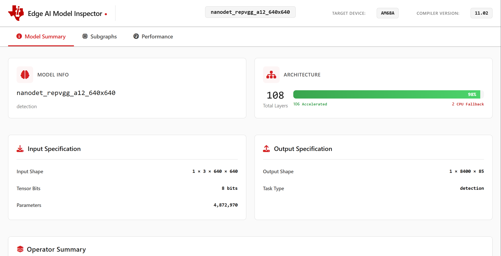
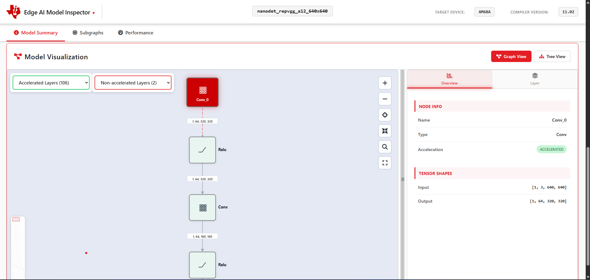
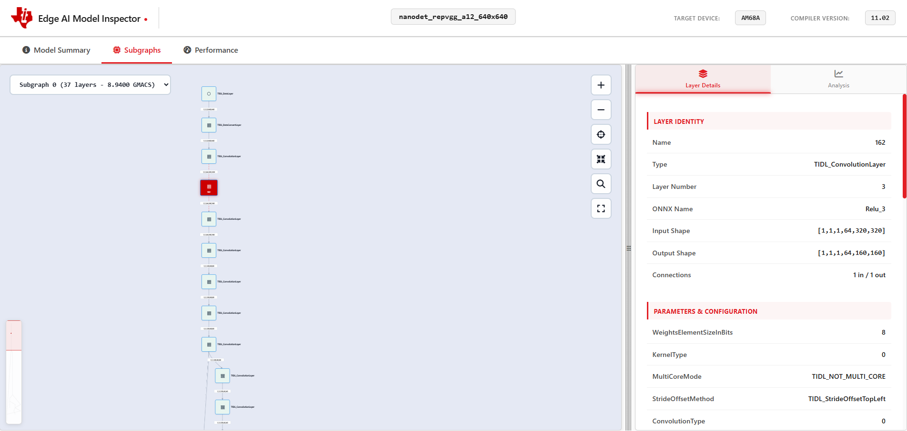
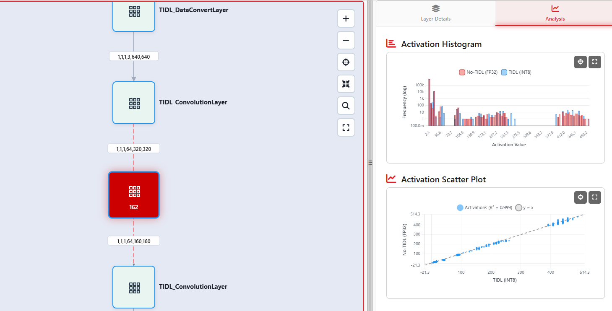
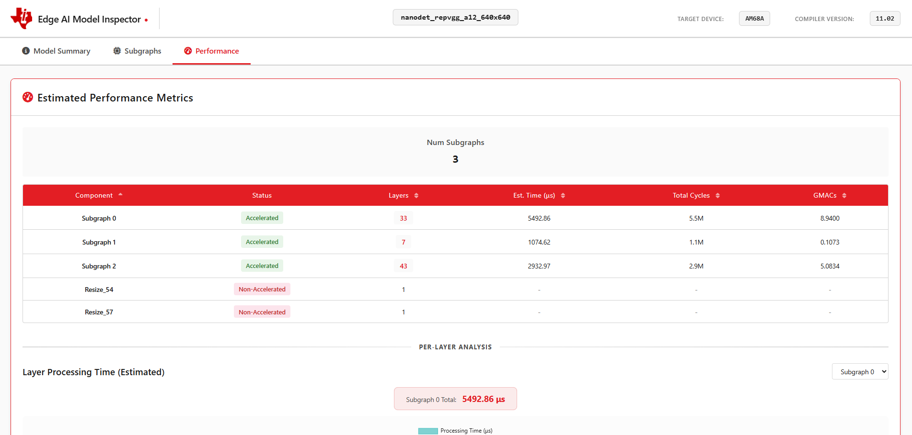
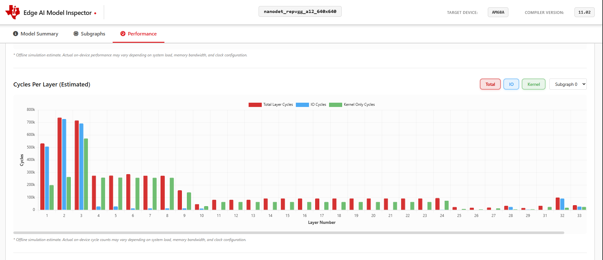
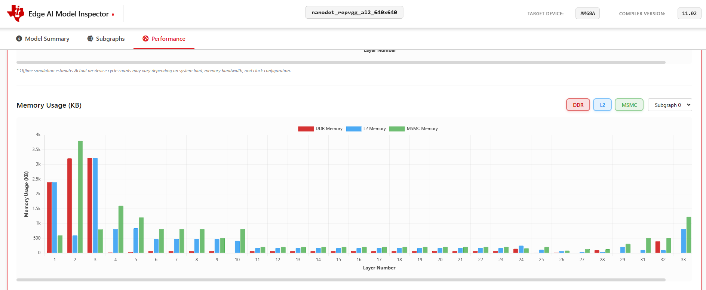
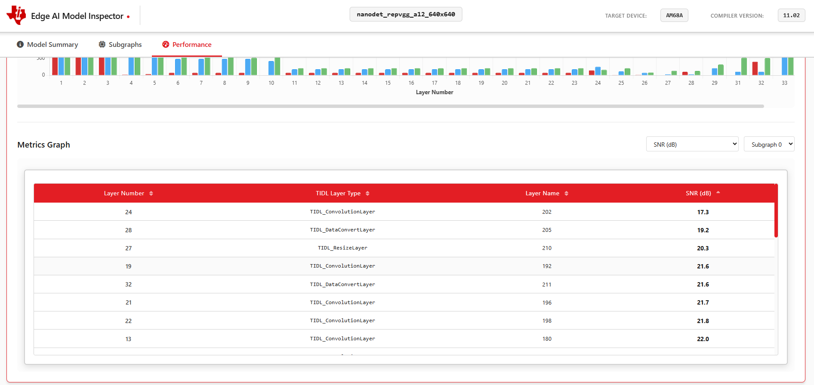

# 🔍 Edge AI Model Inspector

An interactive HTML visualization tool for analyzing ONNX models compiled with TIDL (Texas Instruments Deep Learning). Model Inspector provides comprehensive insights into model structure, performance, accuracy, and hardware acceleration.

---

## 📋 Table of Contents

- [What is Model Inspector?](#what-is-model-inspector)
- [Key Features](#key-features)
- [Quick Start](#quick-start)
- [Usage Examples](#usage-examples)
- [Understanding the Interface](#understanding-the-interface)
- [What Does `inspect` Command Do?](#what-does-inspect-command-do)
- [Requirements](#requirements)

---

## What is Model Inspector?

Model Inspector is an **all-in-one analysis tool** that:

1. ✅ **Compiles** your ONNX model for TIDL acceleration
2. ✅ **Runs inference** on your dataset (TIDL vs reference comparison)
3. ✅ **Analyzes accuracy** layer-by-layer with SNR metrics
4. ✅ **Shows performance** (timing, memory, cycles)
5. ✅ **Generates interactive HTML** with visualizations

**Input:** ONNX model + dataset
**Output:** Self-contained HTML report you can open in any browser

---

## Key Features

### 📊 Comprehensive Analysis

| Feature | What You Get |
|---------|-------------|
| **Interactive ONNX Model Graph** | Node-based visualization with zoom, pan, search |
| **TIDL Subgraph Visualization** | See which layers run on C7x DSP |
| **Performance Profiling** | Per-layer timing, memory usage, cycle counts |
| **Accuracy Analysis** | Layer-by-layer activation comparison (TIDL vs reference) |
| **SNR Metrics** | Signal-to-noise ratio for each layer |
| **Tree View** | Hierarchical model structure navigation |

### 🎨 User-Friendly Interface

- **Tabbed Navigation** - Switch between Model Graph, TIDL Subgraphs and Performance
- **Click-to-Explore** - Click any layer to see detailed information
- **Search & Filter** - Find layers quickly by name or type
- **Export-Ready** - Share HTML files with your team (no server needed!)

### 🚀 Automated Workflow

One command does it all - no need to run compile and infer separately!

---

## Quick Start

### Basic Usage

The simplest way to generate Model Inspector:

```bash
tidlrunner-cli inspect \
  --config_path data/models/vision/classification/imagenet1k/torchvision/mobilenet_v2_tv_config.yaml \
  --target_device AM68A
```

**That's it!** This single command will:
1. Compile your model for TIDL
2. Run inference on your dataset
3. Compare TIDL vs ONNX reference outputs
4. Generate interactive HTML report

### Output Location

The HTML file is generated at:
```
work_dirs/compile/AM68A/8bits/{model_id}/inspector/modelinspector.html
```

---

## Usage Examples

### Example 1: Image Classification

```bash
tidlrunner-cli inspect \
  --config_path data/models/vision/classification/imagenet1k/torchvision/mobilenet_v2_tv_config.yaml \
  --target_device AM68A
```

### Example 2: Object Detection

```bash
tidlrunner-cli inspect \
  --config_path data/models/vision/detection/coco/edgeai-mmdet/yolox_s_lite_640x640_20220221_model_config.yaml \
  --target_device AM68A
```

### Example 3: With Custom Settings

```bash
tidlrunner-cli inspect \
  --model_path data/models/vision/classification/imagenet1k/torchvision/mobilenet_v2_tv.onnx \
  --data_name image_files_dataloader \
  --data_path data/datasets/vision/imagenetv2c/val \
  --target_device AM68A
```

**Parameters Explained:**
- `--model_path`: Your ONNX model file
- `--data_name`: Dataloader type (see Available Dataloaders below)
- `--data_path`: Path to your dataset

### Example 4: Disable Activation Data (Faster, Smaller HTML)

```bash
tidlrunner-cli inspect \
  --config_path data/models/vision/classification/imagenet1k/torchvision/mobilenet_v2_tv_config.yaml \
  --target_device AM68A \
  --act_data=false
```

**Use when:**
- You only need performance metrics don't need Quantization result
- HTML file is too large
- You want faster processing
---

## Understanding the Interface

The Model Inspector HTML has **3 main tabs** for different analysis views:

### 1️⃣ **Model Summary Tab**



**What you see:**
- **MODEL INFO** - Model name and task type
- **ARCHITECTURE** - Visual bar showing acceleration percentage
  - Green: Accelerated layers (running on C7x DSP)
  - Red: CPU Fallback layers
  - Shows total layers count (e.g., "106 Accelerated, 2 CPU Fallback")
- **Input Specification** - Input shape, tensor bits, parameter count
- **Output Specification** - Output shape and task type
- **Operator Summary** - List of operations used in the ONNX model

#### Model Visualization Section



Within the Model Summary tab, scroll down to the **Model Visualization** section:

**Left Side - Graph View:**
- Interactive ONNX model graph
- Each node represents a layer operation
- Red nodes: Currently selected layer
- Gray nodes: Other layers
- Edges show tensor flow between layers

**Filter Options:**
- **Accelerated Layers (X)** - Show only layers running on C7x DSP
- **Non-accelerated Layers (X)** - Show only CPU fallback layers

**View Toggle:**
- **Graph View** - Node-based visualization
- **Tree View** - Hierarchical list view

**Right Side - Layer Information Panel:**

When you click on a node in the graph, the right panel shows 2 tabs:

**Overview Tab:**
- **NODE INFO**
  - Name: Layer name
  - Type: Operation type (Conv, Relu, etc.)
  - Acceleration: Shows "ACCELERATED" badge if running on C7x otherwise "NON-ACCELERATED" and reason behind that
- **TENSOR SHAPES**
  - Input: Input tensor dimensions
  - Output: Output tensor dimensions

**Layer Tab:**
- ONNX layer attributes
- Additional layer-specific parameters

**Navigation Controls:**
- **+** - Zoom in
- **-** - Zoom out
- **⟲** - Reset view
- **⛶** - Fit all nodes
- **🔍** - Search layers
- **⛶** - Fullscreen mode

---

### 2️⃣ **Subgraphs Tab**



**What you see:**
- **Subgraph Dropdown** - Select which subgraph to view (e.g., "Subgraph 0 (37 layers - 8.9400 GMACS)")
- **Left Side** - TIDL subgraph visualization showing accelerated layers

**Right Side - Layer Information Panel:**

When you click on a layer node in the subgraph, the panel shows 2 tabs:

**Layer Details Tab:**

- **LAYER IDENTITY**
  - Name: TIDL layer identifier
  - Type: TIDL layer type (e.g., TIDL_ConvolutionLayer)
  - Layer Number: Sequential number in TIDL
  - ONNX Name: Corresponding ONNX operation name
  - Input Shape: Tensor dimensions
  - Output Shape: Output tensor dimensions
  - Connections: Number of inputs and outputs
  - And more layer level details


- **Analysis Tab:**

This tab shows quantization analysis (only available for layers with matched traces):

  - **Activation Histogram**
    - Red bars: No-TIDL (FP32) - Reference implementation
    - Blue bars: TIDL (INT8) - Quantized implementation
    - X-axis: Activation values
    - Y-axis: Frequency

  - **Activation Scatter Plot**
    - X-axis: TIDL (INT8) activation values
    - Y-axis: No-TIDL (FP32) activation values
    - Blue points: Actual activation comparisons
    - Gray line: y = x (perfect match reference line)

  **What the Analysis Tab tells you:**
  - How well the INT8 quantized values match the ONNX reference
  - Whether quantization introduces significant errors
  - Distribution of activation values in both implementations

---

### 3️⃣ **Performance Tab**



⚠️ **Note:** All metrics in this tab are **estimated** values.

**What you see:**

**Estimated Performance Metrics Table:**
- **Component** - Subgraph name or CPU layer name
- **Status** - "Accelerated" (green) or "Non-Accelerated" (red)
- **Layers** - Number of layers in this component
- **Est. Time (µs)** - Estimated processing time in microseconds
- **Total Cycles** - Total DSP cycles
- **GMACs** - Giga multiply-accumulate operations

**PER-LAYER ANALYSIS Section:**

**Layer Processing Time (Estimated)**
- Dropdown to select subgraph
- Shows total time for selected subgraph (e.g., "Subgraph 0 Total: 5492.86 µs")
- Bar chart showing estimated processing time per layer
- Helps identify bottleneck layers

---

**Additional Performance Charts:**

#### Cycle Per Layer Chart



**What it shows:**
- Bar chart showing DSP cycle breakdown for each layer
- Each layer has **3 bars** representing:
  - **Bar 1 (Total Cycles)**: Total DSP cycles consumed by the layer
  - **Bar 2 (IO Cycles)**: Cycles spent on input/output data transfers
  - **Bar 3 (Kernel Cycles)**: Cycles spent on actual computation

**Controls (Top Right):**
- Toggle button to change display:
  - **3 bars per layer** (default) - Shows Total, IO, and Kernel cycles
  - **2 bars per layer** - Shows two selected cycle types
  - **1 bar per layer** - Shows one selected cycle type

**Understanding the cycles:**
- **Total Cycles** = Total cycles
- High IO cycles relative to Kernel → Layer is memory-bound
- High Kernel cycles relative to IO → Layer is compute-bound

---

#### Memory Usage Chart



**What it shows:**
- Bar chart displaying memory usage for each layer across different memory hierarchies
- Each layer has **3 bars** representing:
  - **Bar 1 (DDR)**: External off-chip memory usage
  - **Bar 2 (L2)**: L2 cache memory usage
  - **Bar 3 (MSMC)**: MSMC usage

**Controls (Top Right):**
- Toggle button to change display:
  - **3 bars per layer** (default) - Shows DDR, L2, and MSMC
  - **2 bars per layer** - Shows two selected memory types
  - **1 bar per layer** - Shows one selected memory type

**Memory Types:**
- **DDR**: Slowest access, largest capacity, off-chip external memory
- **L2**: Fast on-chip cache, core-local storage
- **MSMC**: Shared on-chip memory accessible by all cores

**How to interpret:**
- High DDR usage → Layer requires frequent off-chip access (potential bottleneck)
- High L2 usage → Good data locality, faster access
- High MSMC usage → Shared data accessed by multiple cores

---

#### SNR Metrics Graph



**What it shows:**
- Bar chart displaying SNR metrics for quantization analysis

**Metric Selection (Right Side):**
- Dropdown/selection bar on the right to choose which metric to display:
  - **Mean Absolute Difference** - Average difference between TIDL INT8 and reference FP32
  - **Median Absolute Difference** - Median difference value
  - **Max Absolute Difference** - Maximum difference observed

**What each metric means:**
- **Mean Absolute Difference**: Average quantization error across all activation values
- **Median Absolute Difference**: Middle value of quantization errors (less affected by outliers)
- **Max Absolute Difference**: Worst-case quantization error in the layer

**How to use:**
- Switch between metrics using the selection bar on the right
- Compare different metrics to understand error distribution
- Similar Mean and Median → Uniform error distribution
- Large gap between Mean and Max → Presence of outlier values

---

**Note:** All performance metrics are **estimated values**. Actual hardware performance may vary based on memory bandwidth, cache behavior, pipeline efficiency, and multi-core utilization.

---
## What Does `inspect` Command Do?

The `inspect` command is a **complete analysis pipeline** that runs multiple stages:

```
┌─────────────────────────────────────────────────────────┐
│ Stage 1: Compile with TIDL (8-bit quantization)         │
│  → Optimizes model for C7x DSP acceleration             │
│  → Generates subgraph partitioning                      │
└─────────────────────────────────────────────────────────┘
                         ↓
┌─────────────────────────────────────────────────────────┐
│ Stage 2: Run Inference with TIDL                        │
│  → Processes your dataset through compiled model        │
│  → Captures per-layer activations                       │
│  → Measures performance (time, memory, cycles)          │
└─────────────────────────────────────────────────────────┘
                         ↓
┌─────────────────────────────────────────────────────────┐
│ Stage 3: Compile without TIDL (Reference)               │
│  → Standard ONNX Runtime compilation                    │
│  → Used as ground truth for accuracy comparison         │
└─────────────────────────────────────────────────────────┘
                         ↓
┌─────────────────────────────────────────────────────────┐
│ Stage 4: Run Inference without TIDL                     │
│  → Processes same dataset through reference model       │
│  → Captures reference activations                       │
└─────────────────────────────────────────────────────────┘
                         ↓
┌─────────────────────────────────────────────────────────┐
│ Stage 5: Compile with TIDL (32-bit)                     │
│  → Higher precision variant for comparison              │
└─────────────────────────────────────────────────────────┘
                         ↓
┌─────────────────────────────────────────────────────────┐
│ Stage 6: Run Inference with TIDL (32-bit)               │
│  → Captures 32-bit activations                          │
└─────────────────────────────────────────────────────────┘
                         ↓
┌─────────────────────────────────────────────────────────┐
│ Stage 7: Compare & Analyze                              │
│  → Calculates SNR (Signal-to-Noise Ratio)               │ 
│  → Identifies quantization issues                       │
│  → Generates performance statistics                     │
└─────────────────────────────────────────────────────────┘
                         ↓
┌─────────────────────────────────────────────────────────┐
│ Stage 8: Generate Interactive HTML                      │
│  → Embeds all data into self-contained HTML             │
│  → Compresses activation data for efficiency            │
│  → Creates interactive visualizations                   │
└─────────────────────────────────────────────────────────┘
```

**Key Point:** You don't need to run `compile` or `infer` separately - `inspect` does everything automatically!

---


## Requirements

### TIDL Tools Version

⚠️ **Critical Requirement:** TIDL Tools **11.02 or later**

**Why?**
- TIDL Tools 11.02+ generates **HTML** subgraph files
- Older versions (11.01, 11.00) generate **SVG** files (incompatible with Model Inspector)

**Check your version:**
```bash
tidlrunner-cli --version
```

**If you have version < 11.02:**

You'll see this error:
```
ERROR: TIDL Tools Version Incompatibility

Found SVG subgraph files instead of HTML files

Your TIDL Tools version (< 11.02) generates SVG files for subgraphs.
Model Inspector requires HTML files which are only available in TIDL Tools 11.02+

Solution:
  1. Upgrade to TIDL Tools version 11.02 or later
  2. Recompile your model
  3. Run the inspect command again
```


### Browser Compatibility

| Browser | Support |
|---------|---------|
| Chrome/Chromium | ✅ Fully supported (recommended) |
| Firefox | ✅ Fully supported |
| Edge | ✅ Supported |


--- 
